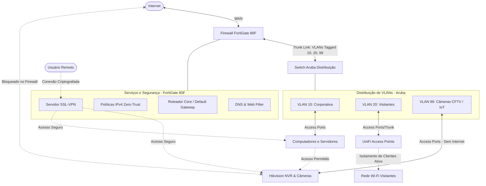

# 🛡️ Awesome Secure Infrastructure: FortiGate, Aruba, UniFi & Hikvision

Este repositório contém guias práticos, referências de comandos (Cheat Sheets) e melhores práticas para desenhar e gerenciar uma **infraestrutura corporativa segura**, combinando **FortiGate**, **Aruba Switches**, **UniFi Wireless** e **Hikvision CFTV**.

O objetivo deste projeto é fornecer a desenvolvedores, SysAdmins e engenheiros de rede um roteiro rápido e direto para implementar o modelo **Zero Trust** no ambiente local (On-Premises), garantindo isolamento total de dispositivos IoT/Câmeras e gerenciamento centralizado de políticas de tráfego.

<!-- DAILY_TIP_START -->
> [!TIP]
> **Dica de Infraestrutura & Segurança (04/07/2026):**
> **Dica de FortiGate:** Para monitorar o tráfego da VPN IPsec em tempo real pela CLI, utilize o comando `get vpn ipsec tunnel details`.
<!-- DAILY_TIP_END -->

<!-- CLOUDFLARE_IPS_START -->
### 🌐 IPs Cloudflare Atualizados
*   **Última verificação automática:** 03/07/2026 as 14:20 (UTC)
*   💾 **[FortiGate CLI Config Script](ips/cloudflare_fortigate.conf)**: Objeto de endereços e grupo prontos para o FortiOS.
*   💾 **[pfSense Alias Network List](ips/cloudflare_pfsense_aliases.txt)**: Lista limpa de subredes IPv4 e IPv6 para colar no alias do pfSense.
<!-- CLOUDFLARE_IPS_END -->

<!-- THREAT_FEED_START -->
### 🛡️ Threat Intelligence IP Feed (Blocklist Ativa)
*   **Última atualização automática:** 03/07/2026 as 14:42 (UTC)
*   **IPs Maliciosos Ativos no Feed:** `1500`
*   🔗 **URL do Feed Raw (Copie para seu Firewall):** `https://raw.githubusercontent.com/WallisonWS/awesome-secure-infrastructure/main/feeds/blocklist-active.txt`
*   ⚙️ **Como usar no seu Firewall:**
    *   **FortiGate:** Vá em *Security Fabric* -> *External Connectors* -> clique em *Create New* -> *IP Address* -> Insira a URL Raw acima e configure a frequência de atualização. Agora use esse conector em regras de firewall de bloqueio.
    *   **pfSense:** Adicione no pacote *pfBlockerNG* na aba *IP* -> *IPv4* como uma nova lista de feed usando a URL Raw acima.
<!-- THREAT_FEED_END -->

---

## 🏗️ Arquitetura de Rede Segura

A arquitetura abaixo ilustra o fluxo de dados e controle entre os dispositivos, utilizando o **FortiGate 80F** como núcleo de roteamento e segurança (Default Gateway), os **Switches Aruba** distribuindo as VLANs físicas e a **Controladora UniFi** gerenciando o isolamento sem fio.

---

## 🔒 Princípios do Design de Segurança Implementado

### 1. Zero Trust na Prática
* Nenhuma rede ou VLAN conversa com a outra por padrão.
* Todo o tráfego inter-VLAN é direcionado para o **FortiGate 80F** (Default Gateway), onde as políticas de firewall filtram o tráfego estritamente necessário.

### 2. Isolamento Total de Dispositivos de CFTV (Hikvision)
* Câmeras e gravadores (NVR) ficam confinados em uma rede restrita (**VLAN 99**).
* **Bloqueio total de Internet:** Nenhuma câmera ou NVR possui rota ou política de acesso externo permitida no firewall. Isso mitiga riscos de vazamento de dados ou sequestro de câmeras por botnets.
* **Acesso Remoto:** O acesso ao aplicativo ou sistema de monitoramento só é permitido aos usuários que conectarem previamente à **SSL-VPN** corporativa do FortiGate.

### 3. Redes sem Fio Isoladas (UniFi)
* SSIDs distintos mapeados diretamente para suas respectivas VLANs.
* A rede de visitantes possui a flag **Client Isolation (Guest Network)** ativa, impedindo que dispositivos conectados conversem entre si na camada 2, evitando vetores de ataque internos.

---

## 📚 Guias Rápidos & CLI Cheat Sheets

Para facilitar a administração do dia a dia, criamos cheat sheets com os comandos CLI mais utilizados nessas plataformas:

* 🔌 **[Aruba Switches CLI Cheat Sheet](aruba-cheat-sheet.md):** Comandos de configuração de VLANs, modo Access/Trunk, LACP e monitoramento de portas.
* 🛡️ **[FortiGate CLI Cheat Sheet](fortigate-cheat-sheet.md):** Comandos de depuração, gerenciamento de rotas, monitoramento de túneis VPN e troubleshooting de pacotes.
* 🧱 **[pfSense CLI & Console Cheat Sheet](pfsense-cheat-sheet.md):** Comandos do shell FreeBSD, diagnósticos de firewall e controle de serviços no pfSense.
* 🔑 **[Active Directory PowerShell Cheat Sheet](active-directory-cheat-sheet.md):** Cmdlets de PowerShell para gerenciamento de usuários, grupos, computadores e auditoria de segurança no AD.

---

## 🤝 Como Contribuir

Este projeto é open-source! Se você tem experiência em outras marcas de infraestrutura (Cisco, Mikrotik, Juniper, pfSense, Palo Alto) e quer adicionar guias ou cheat sheets de configuração segura de VLANs e Firewalls:

1. Faça um **Fork** deste repositório.
2. Crie uma branch com a sua modificação: `git checkout -b feature/minha-infra-segura`.
3. Faça o commit das suas alterações: `git commit -m 'feat: adiciona guia para Mikrotik RouterOS'`.
4. Faça o push para a branch: `git push origin feature/minha-infra-segura`.
5. Abra um **Pull Request**.

---

## 📝 Licença

Distribuído sob a licença MIT. Veja `LICENSE` para mais informações.
